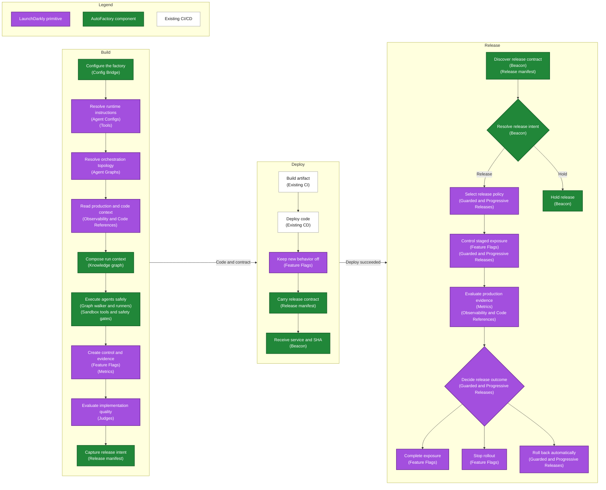

# LaunchDarkly AutoFactory

Every software factory is different. This repository is an opinionated reference
implementation for developing a software factory using **LaunchDarkly primitives**
alongside tools like **Claude Code, Cursor, and Sentry**.

**Terminology:** Build is Phase 1 in package names and runtime logs. Deploy and Release are
Phase 2.

## Why

Software factories have optimized build and deploy. AI accelerates planning, coding,
testing, and review. CI/CD makes production deployment routine. Release is still often an
implicit step, even though it is where customers and risk enter the system.

Deployment proves code is running. Release determines whether customers should receive the
change, whether it works for them, and whether it should keep rolling out.

> **A software factory is incomplete until it can release what it builds, measure the
> outcome, and respond safely.**

## The complete factory

## The flow

| Stage | Job | Output |
|---|---|---|
| **Build** | Make the change release-ready. Preserve the control path, define success and failure, and capture intent. | Flagged code, metrics, tests, review, release manifest |
| **Deploy** | Make the change available without exposing it. Keep the existing delivery pipeline. | Running code, behavior still off, deploy notification |
| **Release** | Control customer exposure using intent and production evidence. | Complete, hold, stop, or roll back |

The goal is not code throughput or deployment frequency in isolation. It is reliable flow
from idea to customer value, with control where uncertainty is highest.

## LaunchDarkly Primitives

| Primitive | Used in | What it contributes |
|---|---|---|
| **Agent Configs** | **Build** | Runtime-defined instructions, models, parameters, variations, targeting, and monitoring |
| **Tools** | **Build** | Reusable tool descriptions and schemas attached to agent variations |
| **Agent Graphs** | **Build** | Agent topology and handoff metadata resolved at runtime |
| **Judges** | **Build** | Sampled quality scores for implementation and metrics changes |
| **Feature Flags** | **Build, Deploy, Release** | Multivariate variations, targeting, prerequisites, and operational controls |
| **Observability and Code References** | **Build, Release** | LLM traces, service dependencies, telemetry coverage, and flag wrap points |
| **Metrics** | **Build, Release** | Custom, trace-based, and Sentry-backed measures tied to flag exposure |
| **Guarded and Progressive Releases** | **Release** | Release policies, staged exposure, production guardrails, and automatic rollback |

## What AutoFactory Adds

| Component | Used in | What it adds |
|---|---|---|
| **[Config Bridge](packages/config-bridge/README.md)** | **Build** | Provisioning and synchronization for Agent Configs, Tools, Agent Graphs, flags, and metrics |
| **[Graph walker and runners](packages/shared/README.md#what-it-owns)** | **Build** | Agent traversal, model-provider execution, routing, approvals, and handoffs |
| **[Sandbox tools and safety gates](packages/shared/README.md#change-agent-capabilities)** | **Build** | Code edits, flag and metric creation, test execution, capability limits, and evidence checks |
| **[Knowledge graph](packages/shared/README.md#add-production-context)** | **Build** | Per-run composition of observability traces, code references, and repository context |
| **[Release manifest](docs/adr/0009-release-intent-and-manifest-steward.md)** | **Build, Deploy, Release** | A versioned contract carrying release plan, human intent, metrics, dependencies, and scope through deployment |
| **[Beacon](packages/beacon/README.md)** | **Deploy, Release** | Deploy notification handling, manifest discovery, intent enforcement, release triggering, and outcome monitoring |

Claude Code and Cursor provide execution surfaces. Sentry provides external error telemetry
and Seer Autofix. They integrate with this reference implementation; LaunchDarkly provides
the primitives above.

## Continue

1. **What:** [Understand the factory design](docs/design-partners-factory.md)
2. **How:** [Set up the reference implementation](REFERENCE.md)
3. **Inspect:** [Explore the detailed pipeline](docs/pipeline-overview.html)

Implementation references:

- [Build orchestration](packages/shared/README.md)
- [Release orchestration](packages/beacon/README.md)
- [Architecture decisions](docs/adr/)
